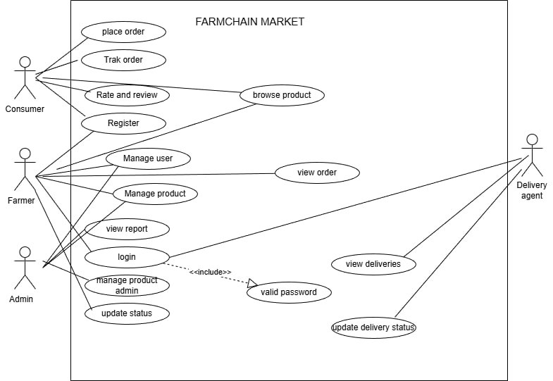

# FarmChain Market

## 🌾 Project Overview
[cite_start]FarmChain Market is a digital platform designed to bridge the gap between farmers and consumers. [cite_start]By removing middlemen, the system ensures farmers earn fair profits and consumers receive fresh, quality products at reasonable prices[cite: 1424, 1425].

## 🛠️ Technical Stack
[cite_start]The system is designed using a **Three-Tier Web Architecture**[cite: 1869]:
* [cite_start]**Frontend:** HTML, CSS, JavaScript [cite: 1503, 1872]
* [cite_start]**Backend:** PHP [cite: 1504, 1879]
* [cite_start]**Database:** MySQL [cite: 1505, 1887]

## 📊 System Design
[cite_start]This project follows a Structured SDLC approach[cite: 1481]. The current repository contains full documentation including:
* [cite_start]**Functional Requirements** (User registration, product management, order placement) [cite: 1595-1610]
* [cite_start]**UML Modeling** (Use Case, Class, Sequence, and Activity Diagrams) [cite: 1649, 1692, 1819, 1822]

## 🖼️ System Analysis

